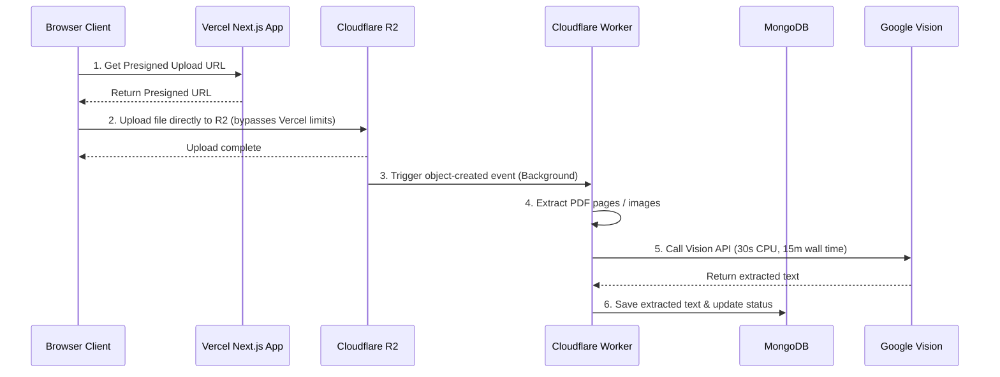

# Vercel Free-Tier Google OCR Failures: Diagnosis & Workarounds

On Vercel's **Hobby (free) tier**, serverless functions have strict limits that directly clash with OCR processing (especially for multi-page PDFs or image fallback pipelines):

1. **10-Second Execution Timeout**: Serverless functions on the Hobby tier are forcefully terminated after 10 seconds. Heavy tasks like parsing PDFs, calling the Google Vision API for multiple batches, or compiling WebAssembly to run `tesseract.js` locally will easily exceed this limit.
2. **4.5 MB Payload Limit**: Next.js API route handlers on Vercel cannot accept request payloads larger than 4.5 MB. If a user uploads a large PDF or high-resolution image, Vercel will reject it with a `413 Payload Too Large` error before it even reaches your code.
3. **CPU & RAM Constraints**: Local fallbacks like `tesseract.js` and `jimp` require high CPU utilization and memory allocations (capped at 1024MB on Vercel Hobby), which runs extremely slowly in un-warmed serverless containers.

Below are four recommended fixes and workarounds to resolve these limitations.

---

## Workaround 1: Cloudflare R2 Event-Driven OCR (Recommended)

Since the application already uploads documents to **Cloudflare R2** (`uploadToR2`), you can leverage Cloudflare's native infrastructure to handle OCR asynchronously.

### How It Works
1. The frontend uploads the document directly to Cloudflare R2 (bypassing Vercel's 4.5MB limit).
2. A **Cloudflare Worker** is configured with an **R2 Bucket Trigger** (`r2:ObjectCreated`).
3. Whenever a new file is uploaded, the Worker is automatically invoked.
4. The Worker calls the Google Vision API directly, extracts the text, and updates the document record in MongoDB.



### Why It Works
- **No Vercel limits**: Vercel is only used to generate presigned upload URLs (taking < 100ms).
- **Generous Free Limits**: Cloudflare Workers have a 30s CPU limit, but **network waiting time does not count against CPU limits**. A worker can wait on Google's OCR API for minutes without timing out.
- **Cost**: Cloudflare Workers and R2 have massive free tiers (100k requests/day for Workers, 10GB storage for R2).

---

## Workaround 2: Browser-Based Local OCR (Client-Side)

If you use the local `tesseract.js` pipeline as a fallback, you can move that logic from the Vercel server directly to the user's browser. 

### How It Works
1. The user selects a file in the browser.
2. If it's an image or a scanned PDF, the browser uses `tesseract.js` (running in a Web Worker) to perform OCR directly on the client's machine.
3. Once the client-side OCR completes, the extracted text is sent to the Vercel API endpoint as a JSON string *along with* the file metadata.

```javascript
// Example: Client-side OCR before upload
import { createWorker } from 'tesseract.js';

async function performClientOCR(file) {
  const worker = await createWorker('eng');
  const imageURL = URL.createObjectURL(file);
  const { data: { text } } = await worker.recognize(imageURL);
  await worker.terminate();
  return text;
}
```

### Why It Works
- **Zero Server Overhead**: Vercel does not do any CPU-intensive OCR processing.
- **No Timeouts**: Client-side execution is not bound by Vercel's 10-second limit.
- **UX**: You can display a real-time OCR progress bar to the user in the frontend UI.

---

## Workaround 3: Page-by-Page Parallel Chunking

If you want to keep using Google Cloud Vision API on the server, you can avoid timeouts by processing multi-page PDFs page-by-page.

### How It Works
1. The frontend splits a PDF into individual page images (using a client-side library like `pdfjs-dist`).
2. The frontend sends individual page upload requests to a lightweight Vercel route `/api/documents/ocr-page` in parallel.
3. Each page is processed individually. Since a single page is lightweight, Google Vision returns results in 1–2 seconds (well within the 10s timeout).
4. Once all pages finish, the frontend merges the results and saves the document.

### Why It Works
- Parallelizing the requests ensures no single request lasts longer than a couple of seconds.
- Fits perfectly within Vercel's serverless concurrency model.

---

## Workaround 4: Deploy a Microservice on Railway / Render (Free Tier)

You can move the heavy OCR code into a standalone Node/Express service hosted on a persistent container platform.

### How It Works
1. Build a simple Express app containing the `document-extract.ts` utility.
2. Deploy it to **Railway** or **Render**'s free tier. 
3. When Vercel receives an upload, it makes a webhook request to your Express app and waits for the response.

### Why It Works
- Render and Railway use persistent containers (not serverless functions), meaning they do not enforce a strict 10-second timeout.
- The Vercel function still has a 10s limit, so you would need to poll the microservice asynchronously, but the microservice itself can take as long as it needs to finish the OCR.
